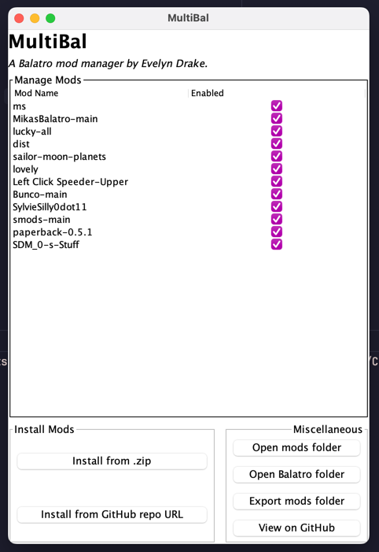

# MultiBal
*A mod manager for the game [Balatro](https://www.playbalatro.com/).*

## Features
- Install mods from a GitHub repo URL
- Install mods from a .zip file
- Easily enable and disable your installed mods
- Export your current mod list as a .zip file that can be imported later
## Usage
- Open the program
- Navigate to your Mods folder
- *Note: This program will not install [Lovely](https://github.com/ethangreen-dev/lovely-injector) or [Steamodded](https://github.com/Steamodded/smods) for you, which are required to use most mods.*
## To-do
- Save the path to the mod folder so the user only needs to navigate it upon the first launch
- Compile executables
- Clean up and refactor code--it's so bad